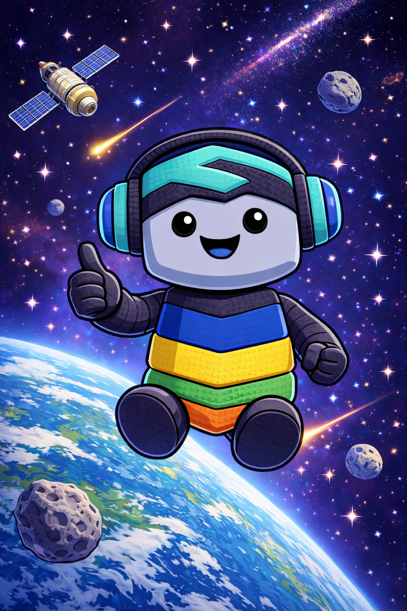
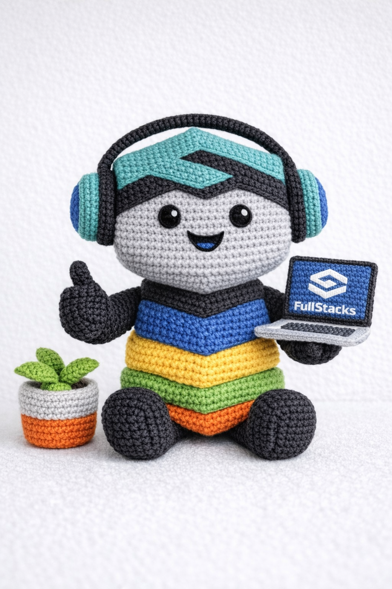
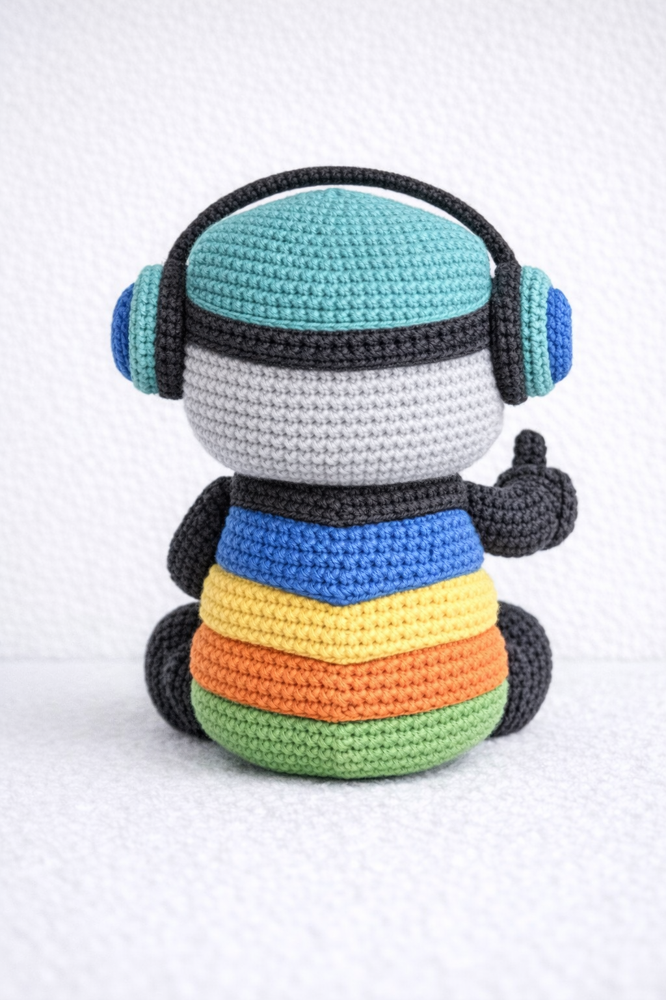
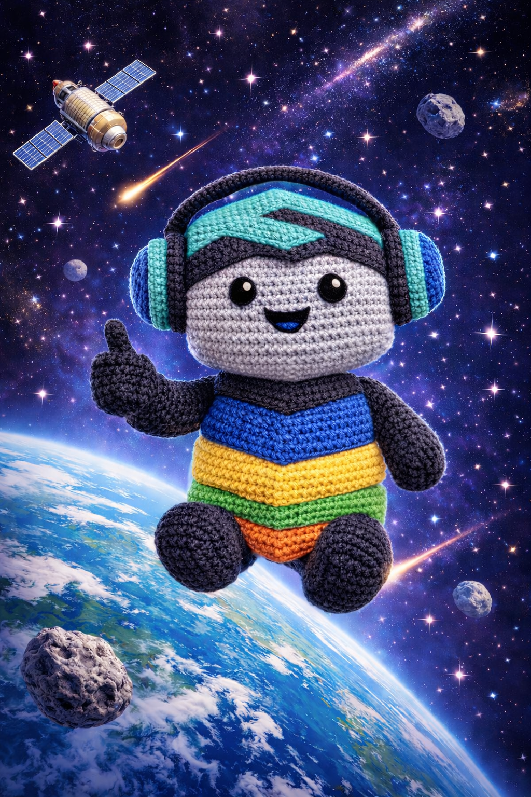

# 🧶 FullStacks Crochet Mascot

Crochet pattern for a small robot mascot inspired by  
[FullStacks](https://fullstacks.io).

The mascot is designed as a **mini amigurumi robot (~15 cm)** and follows the visual identity of **FullStacks**.

Brand reference:  
https://fullstacks.io/brand-kit/

The **robot body represents the stack colors**, while all other elements follow the **primary FullStacks brand colors**.

---

# Preview

  

---

# Crochet Version

  
  

---

# Materials

Recommended yarn:

**Gründl Cotton Quick uni**  
https://www.gruendl.com/cotton-quick-uni/

Suggested colors:

| Color | Usage |
|------|------|
| Light Grey | Head |
| Black | Arms, legs, headphones, laptop seam |
| Emerald | Headband, logo elements, headphone outside |
| Medium Blue | Body segment (stack color), headphone inside, laptop screen |
| Yellow | Body segment (stack color) |
| Light Green | Body segment (stack color), plant |
| Orange | Body segment (stack color), flower pot |
| Silver Grey | Laptop |

Other materials:

- Crochet hook **2.5 mm**
- Fiberfill stuffing
- Stitch marker
- Yarn needle

---

# Finished Size

Approximately **14–15 cm height**

---

# Pattern Structure

The mascot consists of the following parts:

1. Head  
2. Headband  
3. Logo (3 parts)  
4. Headphones  
5. Body  
6. Legs  
7. Arms with thumb  
8. Laptop  
9. Plant  

---

# Crochet Pattern

## Abbreviations

| Abbreviation | Meaning |
|---------------|--------|
| MR | Magic Ring |
| sc | single crochet |
| BLO | back loop only |
| FLO | front loop only |

---

# Head

Color: Light Grey  
Technique: Spiral

Round 1: MR, 6 sc (6)  
Round 2: increase each stitch (12)  
Round 3: (1 sc, inc) ×6 (18)  
Round 4: (2 sc, inc) ×6 (24)  
Round 5: (3 sc, inc) ×6 (30)  
Round 6: (4 sc, inc) ×6 (36)  
Round 7: (5 sc, inc) ×6 (42)  
Round 8: (6 sc, inc) ×6 (48)

Round 9–11: 48 sc  
Round 12: 48 sc BLO

Round 13: (6 sc, dec) ×6 (42)  
Round 14: 42 sc  
Round 15: (6 sc, inc) ×6 (48)  
Round 16: 48 sc

Round 17: (6 sc, dec) ×6 (42)  
Round 18: (5 sc, dec) ×6 (36)  
Round 19: (4 sc, dec) ×6 (30)

Stuff firmly.

Round 20: (3 sc, dec) ×6 (24)  
Round 21: (2 sc, dec) ×6 (18)  
Round 22: (1 sc, dec) ×6 (12)  
Round 23: dec ×6 (6)

Close.

---

# Headband

Color: Emerald / Black

Emerald:

Round 1: MR, 6 sc  
Round 2: inc each stitch (12)  
Round 3: (1 sc, inc) ×6 (18)  
Round 4: (2 sc, inc) ×6 (24)  
Round 5: (3 sc, inc) ×6 (30)  
Round 6: (4 sc, inc) ×6 (36)  
Round 7: (5 sc, inc) ×6 (42)  
Round 8: (6 sc, inc) ×6 (48)  
Round 9: (7 sc, inc) ×6 (54)

Black:

Round 10: 54 sc BLO  
Round 11–13: 54 sc

---

# Logo

Color: Emerald

Three separate parts:

### Center bar

4 ch  
Row 1: 3 sc  
Row 2: 3 sc  
Row 3: 3 sc

### Upper bar

3 ch  
Row 1: 2 sc  
Row 2: 2 sc  
Row 3: sc under row 1

### Lower bar

7 ch  
Row 1: 6 sc  
Row 2: 6 sc  
Row 3: sc under row 1

Sew together to form the logo.

---

# Laptop

Color: Silver Grey

12 ch

Row 1–7: 11 sc, turn

Turn work

Row 8: 11 sc BLO  
Row 9: 11 sc FLO

Row 10–16: 11 sc

Fold along BLO/FLO rows and lightly stuff.

Close edges with black sc.

### Keyboard

8 ch  
Row 1: 7 sc  
Row 2–3: 7 sc

### Screen

12 ch  
Row 1–7: 11 sc

Attach to the inner top edge.

---

# Assembly

1. Sew logo pieces together  
2. Attach logo to headband  
3. Sew headband to head  
4. Attach headphones  
5. Sew head to body  
6. Attach legs  
7. Attach arms  
8. Sew laptop into left hand  
9. Attach plant

---

# Credits

Mascot inspired by **FullStacks**

Website:  
https://fullstacks.io

Brand guidelines:  
https://fullstacks.io/brand-kit/

  

---

# Yarn

Pattern designed using:

**Gründl Cotton Quick uni**

https://www.gruendl.com/cotton-quick-uni/

---
